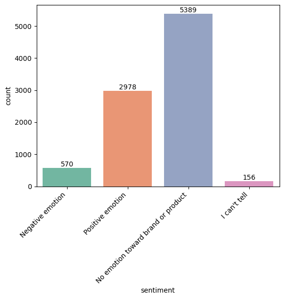

# Twitter Sentiment Analysis Project

## Overview
This project performs sentiment analysis on Twitter data to classify tweets into:

- ✅ **Positive Emotion** – Tweets expressing satisfaction, excitement, or favorable opinions about a brand or product.
- ❌ **Negative Emotion** – Tweets expressing frustration, disappointment, or criticism toward a brand or product.
- 😐 **No Emotion Toward Brand or Product** – Neutral tweets that mention brands or products without expressing a clear positive or negative sentiment

| Sentiment                          | Count     | Percentage (%) |
| ---------------------------------- | --------- | -------------- |
| No emotion toward brand or product | 5,389     | 59.3%          |
| Positive emotion                   | 2,978     | 32.8%          |
| Negative emotion                   | 570       | 6.3%           |
| I can't tell                       | 156       | 1.7%           |
| **Total**                          | **9,093** | **100.0%**     |

Multiple machine learning models were trained and evaluated to identify the best-performing approach for real-world social media sentiment classification. The project demonstrates how natural language processing (NLP) and machine learning can be applied to extract actionable insights from unstructured social media data.

## 🧠 Objective

The primary objectives of this project are:

- To analyze public sentiment on Twitter regarding technology brands and products.
- To preprocess and clean raw tweet text for effective feature extraction.
- To build and compare multiple machine learning models for sentiment classification.
- To identify the model that best balances overall accuracy and performance on minority sentiment classes.
- To interpret model predictions using explainable techniques like LIME.
- To provide actionable insights for organizations to monitor brand perception and improve products.

## 📂 Dataset

The dataset used in this project consists of Twitter posts related to technology brands and products. Each record includes:

- **Tweet text content** – The original raw text of the tweet.
- **Brand or product labels** – Identifies which brand or product the tweet discusses (e.g., Apple, Google, iPad, iPhone).
- **Sentiment labels** – Human-annotated labels indicating Positive, Negative, or No Emotion Toward Brand or Product.

The dataset reflects real-world social media conversations, including informal language, abbreviations, emojis, and mentions of competing brands.

## 🛠️ Data Preprocessing

Raw tweet text is noisy and contains many elements that do not contribute to sentiment classification. The following preprocessing steps were applied to clean and standardize the text:

| Step | Description |
|------|-------------|
| Lowercasing | Converts all text to lowercase to ensure consistency (e.g., "Great" and "great" become the same). |
| URL removal | Removes any hyperlinks (e.g., `https://t.co/...`) as they rarely add sentiment value. |
| Username removal | Removes @mentions (e.g., `@AppleSupport`) to focus on content rather than user tags. |
| Punctuation removal | Strips punctuation marks (e.g., `!`, `?`, `.`, `,`) to reduce noise. |
| Stopword removal | Removes common words like *the*, *and*, *is* that do not carry sentiment. |
| Tokenization | Splits text into individual words or tokens for further processing. |

These preprocessing steps significantly reduced noise in the dataset and improved the quality of textual features used by machine learning models.

## 🔧 Feature Engineering

After preprocessing, the cleaned text needed to be converted into a numerical format that machine learning algorithms can process.

- **TF-IDF Vectorization** – Converts text into numerical features based on term frequency-inverse document frequency. This method gives higher weight to words that appear frequently in a specific tweet but rarely across the entire dataset, helping to identify distinctive sentiment-bearing terms.

- **Optional n-grams** – In addition to single words (unigrams), the model can also capture pairs of words (bigrams) or triple words (trigrams). For example, "not good" is a bigram that carries different sentiment than "good" alone.

- **Sparse matrix representation** – Since TF-IDF produces a matrix with many zero values (most tweets do not contain most words), sparse matrix formats are used to store data efficiently and reduce memory usage.

## 🤖 Machine Learning Models

Three different classifiers were trained and evaluated on the same dataset to compare performance:

| Model | Description |
|-------|-------------|
| **Multinomial Naïve Bayes** | A probabilistic classifier commonly used for text classification. It assumes feature independence and works well with high-dimensional sparse data. |
| **Logistic Regression** | A linear model that estimates the probability of each class. It is interpretable, efficient, and performs well on text data. Served as the baseline model. |
| **LinearSVC** | A support vector machine classifier with a linear kernel. It finds the optimal hyperplane separating classes and is known for good performance on high-dimensional text data. |

## 📈 Model Performance

The models were evaluated using two primary metrics:

- **Accuracy** – The proportion of total correct predictions. Useful but can be misleading when classes are imbalanced.
- **Macro F1 Score** – The average of F1 scores across all three classes, giving equal weight to positive, negative, and neutral categories. This is a more reliable metric for imbalanced datasets.

| Model | Accuracy | Macro F1 Score |
|-------|----------|----------------|
| Multinomial Naïve Bayes | 0.84 | 0.58 |
| Logistic Regression | 0.91 | 0.73 |
| **LinearSVC** | **0.91** | **0.78** |

## 🏆 Best Model

**LinearSVC** was selected as the final model for this project because it achieved:

- **High overall accuracy (91%)** – Matching the best-performing model.
- **The best macro F1 score (0.78)** – Outperforming both alternatives.
- **Balanced performance across all sentiment classes** – Particularly effective at identifying the minority negative class, which is often the most challenging.

Hyperparameter tuning was performed using GridSearchCV with macro F1 as the optimization metric, further improving the model's robustness and fairness.

## ⚖️ Class Imbalance Handling

One of the key challenges in this project was class imbalance:

- The dataset is dominated by **neutral** tweets (No Emotion Toward Brand or Product).
- **Positive** tweets are moderately represented.
- **Negative** tweets form the smallest class.

If accuracy alone were used as the metric, a model could simply predict "neutral" for every tweet and achieve high accuracy while failing completely on negative sentiment detection. To address this:

- **Macro F1 score** was used instead of accuracy for model evaluation and tuning.
- Class imbalance remains a limitation, and future work should explore:
  - **SMOTE (Synthetic Minority Oversampling Technique)** – Generating synthetic examples of minority classes.
  - **Class weighting** – Giving higher penalty for misclassifying minority classes.
  - **Resampling** – Undersampling the majority class or oversampling minority classes.

## 🔍 Model Interpretability

Understanding *why* a model makes a particular prediction is crucial for trust and debugging. This project used **LIME** (Local Interpretable Model-Agnostic Explanations) to:

- **Explain individual predictions** – For any given tweet, LIME shows which words pushed the model toward positive, negative, or neutral classification.
- **Identify influential keywords** – Words like *love*, *great*, *crash*, and *broken* consistently influenced predictions.
- **Confirm model validity** – The model relied on intuitive and meaningful sentiment patterns rather than spurious correlations.

## 📊 Key Insights

The analysis revealed several important findings about sentiment expression on Twitter:

| Insight | Description |
|---------|-------------|
| 🟡 **Neutral tweets dominate** | Most users mention brands or products while asking questions, sharing news, or making neutral observations without strong emotion. |
| 🔴 **Negative sentiment is hardest to classify** | Sarcasm, informal language, incomplete sentences, and limited context make negative tweets more challenging for models. |
| 🟢 **Positive sentiment is easiest to classify** | Positive tweets frequently contain clear praise words like *love*, *great*, *excellent*, and *amazing*. |
| 🏷️ **Brand and product names are strong predictors** | Mentions of specific products (e.g., *iPad*, *iPhone*) provide context that helps distinguish sentiment direction. |
| 📱 **Apple and Google dominate conversations** | These two brands generate the highest volume of discussion and sentiment expression. |
| ⚙️ **Technical issues drive negative sentiment** | Words like *crash*, *broken*, *issue*, and *problem* are strongly associated with negative tweets, indicating that product reliability is a major concern. |

## 🚀 Technologies Used

| Category | Tools |
|----------|-------|
| Programming Language | Python 3.11+ |
| Machine Learning | Scikit-learn (LinearSVC, Logistic Regression, Multinomial NB) |
| Data Handling | Pandas, NumPy |
| Text Processing | NLTK (stopwords, tokenization), TF-IDF Vectorizer |
| Visualization | Matplotlib, Seaborn |
| Model Interpretability | LIME (Local Interpretable Model-Agnostic Explanations) |
| Development Environment | Jupyter Notebook / Python scripts |

## 📌 Future Improvements

While the current model performs well, several enhancements could further improve accuracy and robustness:

| Area | Proposed Improvement |
|------|----------------------|
| 🤖 **Advanced models** | Implement BERT, RoBERTa, or other transformer-based models to better capture context, sarcasm, and nuanced language. |
| 🎯 **Aspect-based sentiment analysis** | Move beyond overall tweet sentiment to target specific product features like battery life, camera quality, or customer support. |
| 📈 **Larger datasets** | Collect or combine multiple Twitter sentiment datasets to improve generalization and minority class representation. |
| 🔄 **Temporal sentiment tracking** | Analyze how sentiment changes over time in response to product launches, software updates, or PR incidents. |
| 🌍 **Multilingual support** | Extend the model to handle tweets in multiple languages. |

## 👨‍💻 Author

**Stephen Mwaura**

## 🙏 Acknowledgments

- Dataset providers and annotators
- Open-source libraries used in this project
- The NLP and machine learning research community