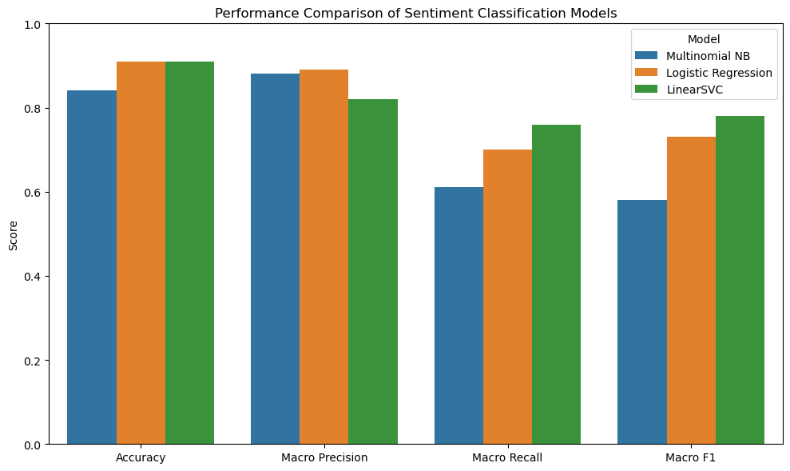
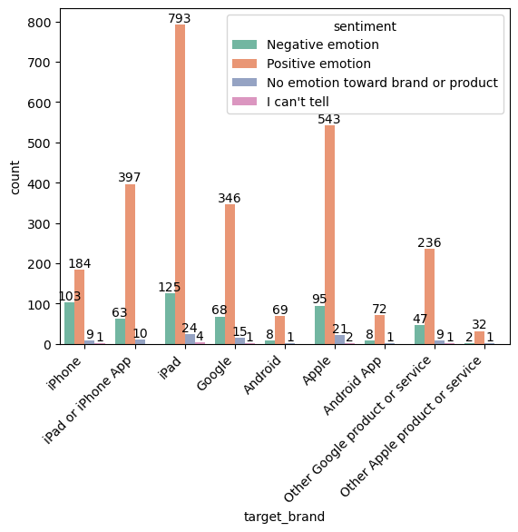
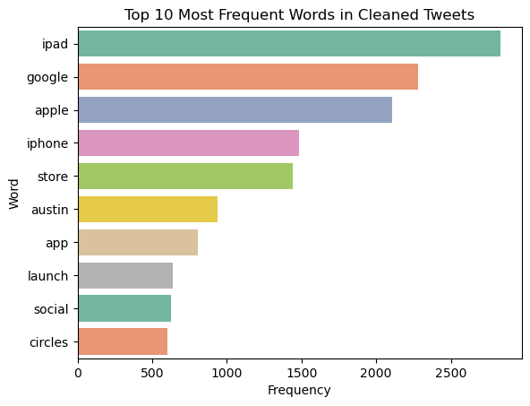
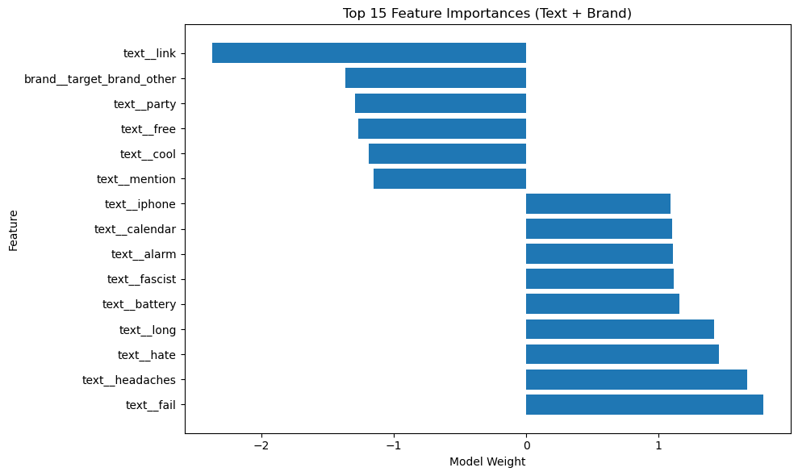
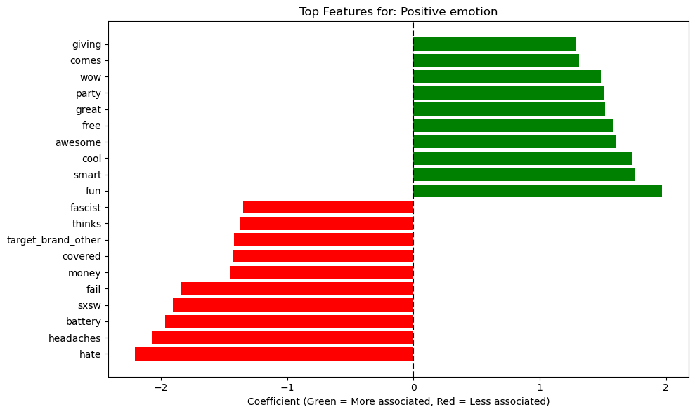

# Twitter Sentiment Analysis Project

## Business Problem

Manually analyzing thousands of tweets is time-consuming, resource-intensive, and impractical at scale. Without automation, companies risk missing critical customer feedback, delaying responses to product issues, and failing to capitalize on positive sentiment. This project addresses the need for an automated sentiment classification system that can efficiently process large volumes of social media data.

Such a system enables organizations to:

* Monitor customer satisfaction in real time.

* Detect product issues early before they escalate.

* Measure public reaction to product launches and updates.

* Improve customer engagement strategies through data-driven insights.

## Overview
This project performs sentiment analysis on Twitter data to classify tweets into:

- **Positive Emotion** – Tweets expressing satisfaction, excitement, or favorable opinions about a brand or product.
- **Negative Emotion** – Tweets expressing frustration, disappointment, or criticism toward a brand or product.
- **No Emotion Toward Brand or Product** – Neutral tweets that mention brands or products without expressing a clear positive or negative sentiment
- **i Cann't tell** - Tweets preferring not to give any sentiment.

Multiple machine learning models were trained and evaluated to identify the best-performing approach for real-world social media sentiment classification. The project demonstrates how natural language processing (NLP) and machine learning can be applied to extract actionable insights from unstructured social media data.

## Objective

The primary objectives of this project are:

- To analyze public sentiment on Twitter regarding technology brands and products.
- To preprocess and clean raw tweet text for effective feature extraction.
- To build and compare multiple machine learning models for sentiment classification.
- To identify the model that best balances overall accuracy and performance on minority sentiment classes.
- To interpret model predictions using explainable techniques like LIME.
- To provide actionable insights for organizations to monitor brand perception and improve products.

## Dataset

The dataset used in this project consists of Twitter posts related to technology brands and products. Each record includes:

- **Tweet text content** – The original raw text of the tweet.
- **Brand or product labels** – Identifies which brand or product the tweet discusses (e.g., Apple, Google, iPad, iPhone).
- **Sentiment labels** – Human-annotated labels indicating Positive, Negative, or No Emotion Toward Brand or Product.

The dataset reflects real-world social media conversations, including informal language, abbreviations, emojis, and mentions of competing brands.

## Data Preprocessing

Raw tweet text is noisy and contains many elements that do not contribute to sentiment classification. The following preprocessing steps were applied to clean and standardize the text:

| Step | Description |
|------|-------------|
| Lowercasing | Converts all text to lowercase to ensure consistency (e.g., "Great" and "great" become the same). |
| URL removal | Removes any hyperlinks (e.g., `https://t.co/...`) as they rarely add sentiment value. |
| Username removal | Removes @mentions (e.g., `@AppleSupport`) to focus on content rather than user tags. |
| Punctuation removal | Strips punctuation marks (e.g., `!`, `?`, `.`, `,`) to reduce noise. |
| Stopword removal | Removes common words like *the*, *and*, *is* that do not carry sentiment. |
| Tokenization | Splits text into individual words or tokens for further processing. |

These preprocessing steps significantly reduced noise in the dataset and improved the quality of textual features used by machine learning models.

## Feature Engineering

After preprocessing, the cleaned text needed to be converted into a numerical format that machine learning algorithms can process.

- **TF-IDF Vectorization** – Converts text into numerical features based on term frequency-inverse document frequency. This method gives higher weight to words that appear frequently in a specific tweet but rarely across the entire dataset, helping to identify distinctive sentiment-bearing terms.

- **n-grams** – In addition to single words (unigrams), the model can also capture pairs of words (bigrams) or triple words (trigrams). For example, "not good" is a bigram that carries different sentiment than "good" alone.

- **Sparse matrix representation** – Since TF-IDF produces a matrix with many zero values (most tweets do not contain most words), sparse matrix formats are used to store data efficiently and reduce memory usage.

## Machine Learning Models

Three different classifiers were trained and evaluated on the same dataset to compare performance:

| Model | Description |
|-------|-------------|
| **Multinomial Naïve Bayes** | A probabilistic classifier commonly used for text classification. It assumes feature independence and works well with high-dimensional sparse data. |
| **Logistic Regression** | A linear model that estimates the probability of each class. It is interpretable, efficient, and performs well on text data. Served as the baseline model. |
| **LinearSVC** | A support vector machine classifier with a linear kernel. It finds the optimal hyperplane separating classes and is known for good performance on high-dimensional text data. |

## Model Performance

The models were evaluated using two primary metrics:

- **Accuracy** – The proportion of total correct predictions. Useful but can be misleading when classes are imbalanced.
- **Macro F1 Score** – The average of F1 scores across all three classes, giving equal weight to positive, negative, and neutral categories. This is a more reliable metric for imbalanced datasets.

| Model | Accuracy | Macro F1 Score |
|-------|----------|----------------|
| Multinomial Naïve Bayes | 0.84 | 0.58 |
| Logistic Regression | 0.91 | 0.73 |
| **LinearSVC** | **0.91** | **0.78** |

## Best Model

**LinearSVC** was selected as the final model for this project because it achieved:

- **High overall accuracy (91%)** – Matching the best-performing model.
- **The best macro F1 score (0.78)** – Outperforming both alternatives.
- **Balanced performance across all sentiment classes** – Particularly effective at identifying the minority negative class, which is often the most challenging.

Hyperparameter tuning was performed using GridSearchCV with macro F1 as the optimization metric, further improving the model's robustness and fairness.

## Class Imbalance Handling

One of the key challenges in this project was class imbalance:

- The dataset is dominated by **neutral** tweets (No Emotion Toward Brand or Product).
- **Positive** tweets are moderately represented.
- **Negative** tweets form the smallest class.

If accuracy alone were used as the metric, a model could simply predict "neutral" for every tweet and achieve high accuracy while failing completely on negative sentiment detection. To address this:

- **Macro F1 score** was used instead of accuracy for model evaluation and tuning.
- Class imbalance remains a limitation, and was handled using:
  - **Class weighting** – Giving higher penalty for misclassifying minority classes.

## Model Interpretability

This project used **global feature importance** and **LIME** to explain model predictions.

### Global Feature Importance

The top 10 features (text + brand) with their weights. Negative weights push toward **Negative** sentiment, positive weights push toward **Positive** sentiment.

### Key Findings

* Positive Emotion Class: Strongest associations are "giving" (1.8), "wow" (1.5), "great" (1.3), "awesome" (1.1), "cool" (1.0), and "fun" (0.8). Negative words like "hate" (-2.6) and "fail" (-1.8) are correctly pushed away.

* Neutral Class: Characterized by "target_brand_other" (2.8), "link" (0.8), and "congress" (0.8). Emotional words like "partying" (-1.2) and specific brands like "Apple" (-0.9) push tweets away from neutrality.

* Overall: The model cleanly separates positive (happy words), neutral (informational content), and negative (complaint words) sentiment with intuitive boundaries.

## LIME Analysis

LIME explains individual predictions by showing which words influenced each decision. This confirmed the model learned intuitive sentiment patterns, though sarcasm remains a limitation for future work.

### Example Prediction Breakdown

The following example shows a tweet classified by the model with prediction probabilities and word-level influences.

### Tweet Text

*"So far the longest line at #sxsw has been at the Apple store."*

### Prediction Probabilities

| Sentiment Class | Probability |
|----------------|-------------|
| Negative Emotion | 0.05 |
| No Emotion Toward Brand or Product | **0.69** |
| Positive Emotion | 0.27 |

**Final Prediction:** `No Emotion Toward Brand or Product`

### Top Influential Words

| Word      | Influence Weight |
|-----------|------------------|
| longest   | +0.19            |
| far       | +0.17            |
| Apple     | +0.14            |
| line      | +0.10            |
| sxsw      | +0.07            |
| store     | +0.03            |

### Interpretation

- The model correctly classified this tweet as **neutral (no emotion toward brand or product)** with 69% confidence.
- The words `longest`, `far`, `Apple`, and `line` were the strongest predictors.
- Despite mentioning `Apple`, the tweet simply observes a long line at the store without expressing positive or negative emotion.
- Low probability for negative (5%) and positive (27%) confirms the neutral classification.

### Concluion

Twitter is a valuable real-time source of consumer opinions on tech brands. Most tweets are neutral, but the sentiment that appears is highly informative.

Positive sentiment ties to favorable experiences, with words like love, great, and excellent reflecting organic brand advocacy.

Negative sentiment is driven by technical issues (crash, broken, problem). Negative tweets are harder to classify due to sarcasm, abbreviations, and limited context.

### Recommendation

Organizations should track negative keywords like crash and broken in real time to detect issues early, prioritize technical improvements since negative sentiment is largely tied to software problems, leverage positive tweets to guide marketing, and enhance customer support by responding quickly on Twitter. Future work should address class imbalance using resampling or class weighting, incorporate advanced NLP models like BERT to better capture sarcasm and context, expand features to include emojis and hashtags, and conduct periodic sentiment monitoring to track shifts after product launches or updates.

## Author : Stephen Mwaura